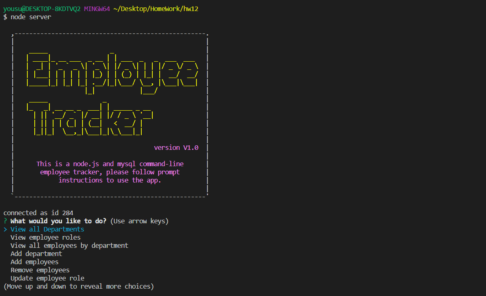
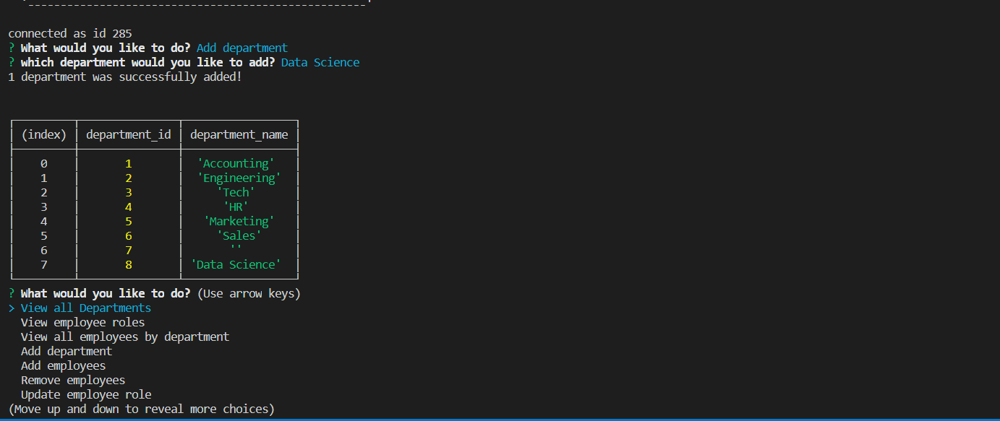
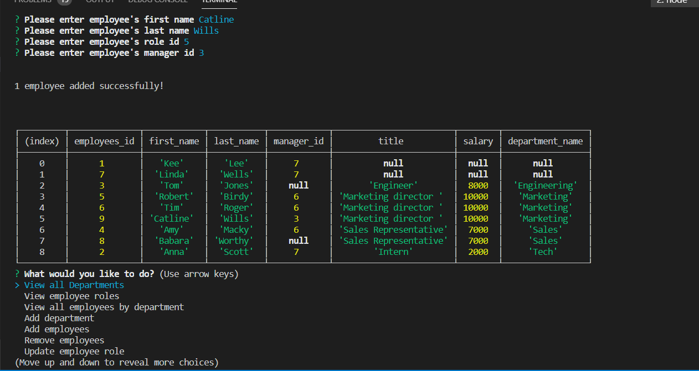
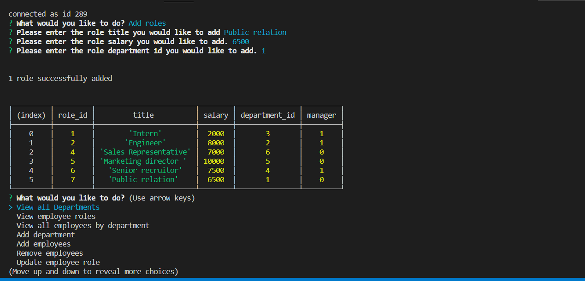
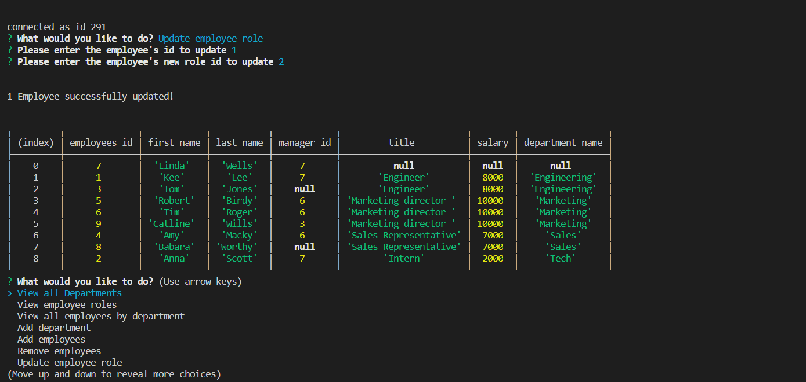
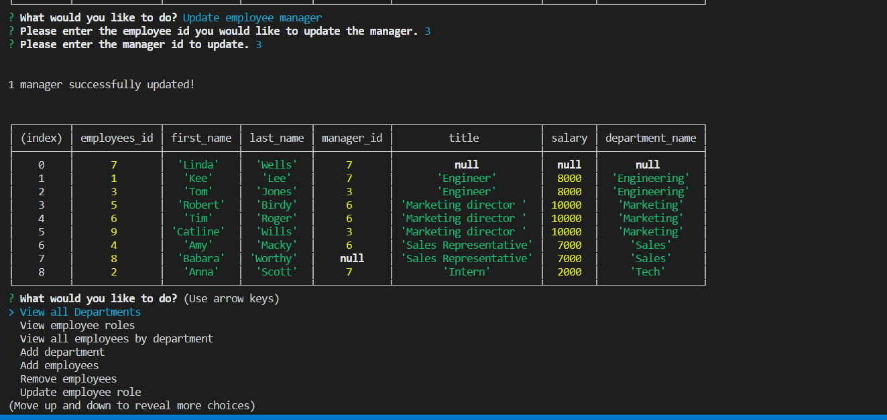
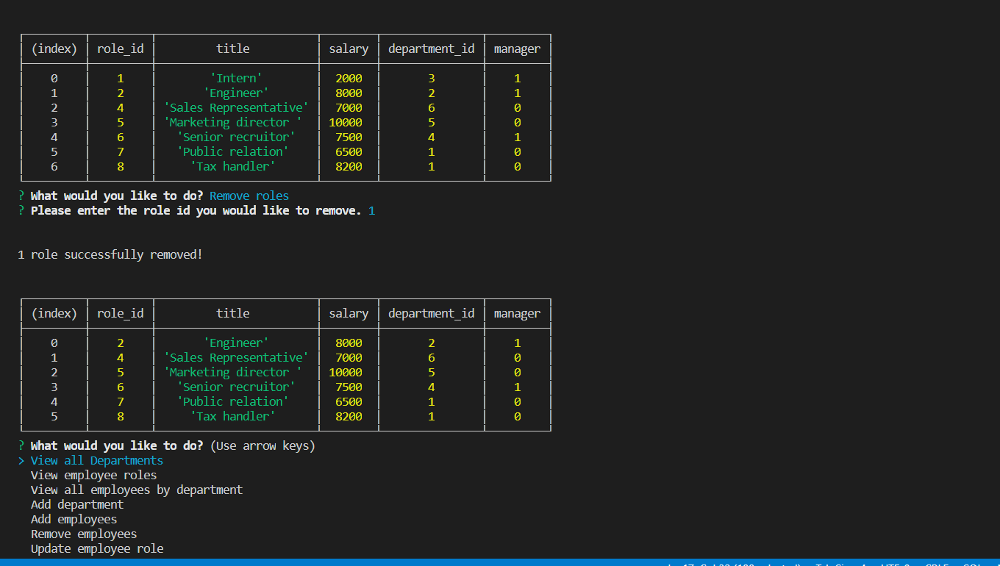
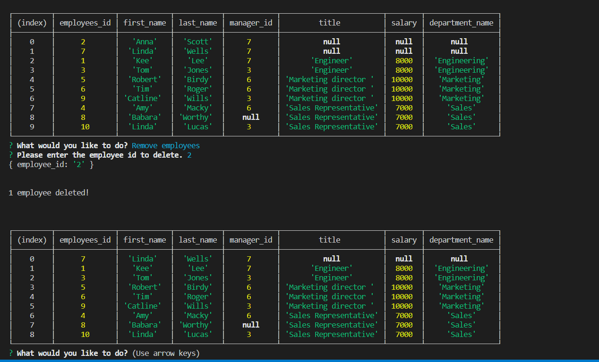

# employee-tracker
### Use node.js and command-line application to manage employee system.

__This app is using command-line application and mysql to mangange employee system. It includes three database tables -- employees, department and role. The app is built with functions such as add/remove departments, add/remove roles, add/remove or update employee informaiton. The display of all the records is applying console.table built-in feature from node js.__

**It requies installation of inquirer and mysql. Inquirer prompts a user to enter his/her choices wishing to process, and node.js interacts with mysql to manipulate the database based on the user action.**

_Please see the screenshots to get the basic ideas of how this app works._

